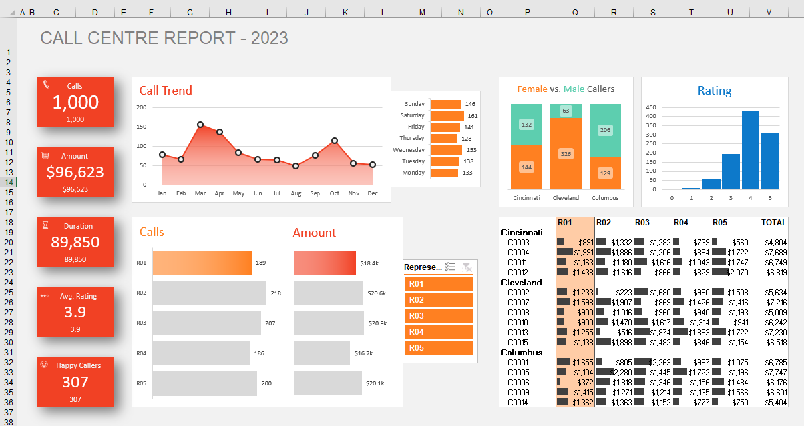

# Call Centre Report Dashboard - 2023

## Overview

The **Call Centre Report Dashboard** provides a detailed analysis of call center performance metrics for the year 2023. The dashboard presents key performance indicators (KPIs) such as the total number of calls, total revenue generated, average call duration, customer satisfaction ratings, and caller demographics. The visualizations help monitor trends, evaluate representative performance, and optimize operational strategies.

## Screenshot

---

## Dashboard Components

### 1. **Key Metrics Panel (Left Section)**
   - **Total Calls**: **1,000** calls handled by the call center.
   - **Total Revenue (Amount)**: **$96,623** generated from calls.
   - **Total Call Duration**: **89,850** seconds (approximately 25 hours).
   - **Average Rating**: **3.9** out of 5, indicating overall customer satisfaction.
   - **Happy Callers**: **307** calls received a rating of 4 or 5.

### 2. **Call Trend Chart**
   - **Type**: Line Chart  
   - Visualizes the monthly trend of calls received throughout the year.  
   - Peaks in March and October indicate high call volumes during those months.

### 3. **Day of the Week Analysis (Bar Chart)**
   - Shows the distribution of calls received on each day of the week.
   - **Saturday** and **Sunday** have higher call counts compared to weekdays, indicating more customer interaction during weekends.

### 4. **Gender Distribution by City (Stacked Bar Chart)**
   - Represents the distribution of male and female callers across key cities:
     - **Cincinnati**, **Cleveland**, and **Columbus**.
   - Helps identify demographic trends in customer interactions.

### 5. **Rating Distribution (Bar Chart)**
   - Displays the count of calls based on customer satisfaction ratings (1 to 5 stars).
   - Majority of the calls have a rating of **4** or **5**, indicating positive customer experiences.

### 6. **Calls and Revenue by Representative (Horizontal Bar Chart)**
   - Shows the number of calls handled and corresponding revenue generated by each representative (R01 to R05).
   - **R02** and **R05** have the highest revenue contributions, highlighting top performers.

### 7. **Location-wise Performance (Matrix Table)**
   - Breaks down the revenue generated from different call centers:
     - **Cincinnati**, **Cleveland**, and **Columbus**.
   - Provides a summary of calls and corresponding revenue for each region and representative.

---

## Insights

- **High Weekend Activity**: Call volumes are notably higher on weekends, indicating the need for increased staffing during those days.
- **Top-Performing Representatives**: Representatives **R02** and **R05** contribute significantly to revenue, showing exceptional performance.
- **Customer Satisfaction**: A high number of **4-star** and **5-star** ratings reflect overall positive customer experiences.
- **City-Wise Caller Distribution**: **Cleveland** has the highest caller interaction among the three cities.

---

